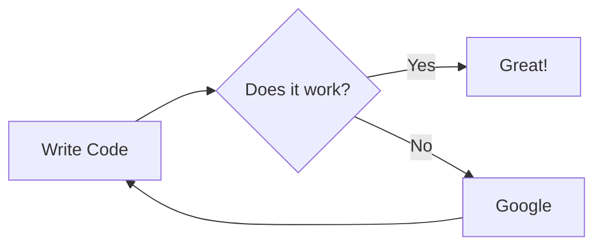

# Home Stack 

<div class="warning" style='padding:0.1em; background-color:#E9D8FD; color:#69337A'>
<span>
<p style='margin-top:1em; text-align:center'>
<b>Home Project Stack</b></p>
<p style='margin-left:1em;'>
The stack is deployed using Kubernetes cluster enabled using microk8s (https://microk8s.io/docs). microk8s is installed using snap package manger. Package is provided by Canonical (publisher of Ubuntu).<br>
- Resources: quad-core ARMx64 processor with 8GB RAM<br>
- Kernel: GNU/Linux 5.4.0-1058-raspi aarch64<br>
- OS: Ubuntu 20.04.4<br><br>
As of now it is deployed on single node cluster.
</p>
<p style='margin-bottom:1em; margin-right:1em; text-align:right; font-family:Georgia'> <b>- Alok Singh</b> 
</p></span>
</div>

## Table of contents 
<!-- TOC -->
* [Home Stack](#home-stack-)
  * [Table of contents](#table-of-contents-)
  * [Deployment of home-stack Kubernetes Stack](#deployment-of-home-stack-kubernetes-stack)
    * [Create Namespaces](#create-namespaces)
    * [Create ConfigMap](#create-configmap)
    * [Create Secrets](#create-secrets)
    * [Create Network policy](#create-network-policy)
    * [MySQL Service - Pod/Deployment/Service](#mysql-service---poddeploymentservice)
    * [Home Network Troubleshoot - Pod/Statefulset/Service](#home-network-troubleshoot---podstatefulsetservice)
    * [Home API Service - Pod/Deployment/Service](#home-api-service---poddeploymentservice)
    * [Home Auth Service - Pod/Deployment/Service](#home-auth-service---poddeploymentservice)
    * [Home Analytics Service - Pod/Deployment/Service](#home-analytics-service---poddeploymentservice)
    * [Home ETL Service - Pod/Statefulset/Service](#home-etl-service---podstatefulsetservice)
    * [Home GIT Commit CronJob](#home-git-commit-cronjob)
    * [Dashboard Service - Pod/Deployment/Service](#dashboard-service---poddeploymentservice)
    * [Jaeger Service](#jaeger-service)
    * [Delete Stack](#delete-stack)
  * [Kubernetes Dashboard](#kubernetes-dashboard)
    * [Pod/Deployment/Service](#poddeploymentservice)
    * [Kubernetes Metrics Server](#kubernetes-metrics-server)
  * [Ingress](#ingress)
    * [Ingress Controller - Enable Nginx Ingress Controller](#ingress-controller---enable-nginx-ingress-controller)
    * [Ingress Create](#ingress-create)
    * [Ingress Delete](#ingress-delete)
  * [RBAC](#rbac)
    * [Enable RBAC](#enable-rbac)
    * [Create roll binding for cluster admin user: alok](#create-roll-binding-for-cluster-admin-user-alok)
    * [Create user alok](#create-user-alok)
      * [Create CSR for user alok](#create-csr-for-user-alok)
      * [Sign User CSR on master node](#sign-user-csr-on-master-node)
      * [Copy User Cert and CA cert](#copy-user-cert-and-ca-cert)
      * [Create Cluster](#create-cluster)
      * [Create User Credentials](#create-user-credentials)
      * [Create User Context](#create-user-context)
      * [Use the context](#use-the-context)
  * [Horizon Autoscaling](#horizon-autoscaling)
    * [Create Horizontal Pod Autoscaler](#create-horizontal-pod-autoscaler)
    * [Update Scale to 1](#update-scale-to-1)
  * [Miscellaneous commands](#miscellaneous-commands)
    * [Client and Server version](#client-and-server-version)
    * [Get Node Details](#get-node-details)
    * [Get Cluster Dump](#get-cluster-dump)
    * [Get all from all namespaces](#get-all-from-all-namespaces)
    * [Get all Services](#get-all-services)
    * [Describe a Service](#describe-a-service)
    * [Get Pod Log](#get-pod-log)
    * [Describe a Pod](#describe-a-pod)
    * [top a pod](#top-a-pod)
    * [Get All Pods under All Namespaces](#get-all-pods-under-all-namespaces)
    * [Describe a spec](#describe-a-spec)
  * [Service Mesh - Istio](#service-mesh---istio)
    * [Install](#install)
  * [Backup](#backup)
    * [Config Map](#config-map)
    * [Secrets](#secrets)
  * [Network Monitoring](#network-monitoring)
    * [Kubeshark](#kubeshark)
      * [Start Monitoring Pods](#start-monitoring-pods)
      * [Stop Monitoring Pods](#stop-monitoring-pods)
  * [Deployment Architecture](#deployment-architecture)
    * [Services](#services)
<!-- TOC -->

## Deployment of home-stack Kubernetes Stack
### Create Namespaces
```shell
kubectl apply -f yaml/namespace.yaml
```
### Create ConfigMap
```shell
kubectl apply -f yaml/config-map.yaml
```
### Create Secrets
```shell
kubectl apply -f yaml/secrets.yaml
```
### Create Network policy
```shell
kubectl apply -f yaml/networkpolicy.yaml
```
### MySQL Service - Pod/Deployment/Service
```shell
ssh alok@jgte mkdir -p /home/alok/data/mysql
```
```shell
kubectl apply --validate=true --dry-run=client -f yaml/mysql-service.yaml 
```
```shell
kubectl apply -f yaml/mysql-service.yaml
```
```shell
kubectl delete -f yaml/mysql-service.yaml
```
```shell
kubectl exec -it pod/mysql-0 --namespace home-stack-db -- mysql -u root -p sys
CREATE DATABASE `home-stack`;
```
```shell
kubectl exec -it pod/mysql-0 --namespace home-stack-db -- mysql -u root -p home-stack
```
```shell
kubectl logs pod/mysql-0 --namespace home-stack-db
```
```shell
mysql -u root -p home-stack --host 127.0.0.1 --port 32306
```
---
**Note:**
>Run liquibase to create batch tables and add application users and roles

>[Follow the link to configure sqldeveloper on Mac to connect to MySQL server remotely](https://cybercafe.dev/setup-mysql-and-sql-developer-on-macos/ "https://cybercafe.dev/setup-mysql-and-sql-developer-on-macos/")
---
### Home Network Troubleshoot - Pod/Statefulset/Service
```shell
kubectl apply --validate=true --dry-run=client -f yaml/home-nw-tshoot.yaml 
```
```shell
kubectl apply -f yaml/home-nw-tshoot.yaml  --namespace=home-stack
```
```shell
kubectl delete -f yaml/home-nw-tshoot.yaml  --namespace=home-stack
```
```shell
kubectl exec -it pod/home-nw-tshoot-deployment-0 --namespace home-stack -- zsh
```
### Home API Service - Pod/Deployment/Service
```shell
kubectl apply --validate=true --dry-run=client -f yaml/home-api-service.yaml 
```
```shell
kubectl apply -f yaml/home-api-service.yaml  --namespace=home-stack
```
```shell
kubectl delete -f yaml/home-api-service.yaml  --namespace=home-stack
```
```shell
kubectl exec -it pod/home-api-deployment-0 --namespace home-stack -- bash
```
```shell
kubectl exec -it pod/home-api-deployment-0 --namespace home-stack -- tail -f /opt/logs/application.log
```
```shell
kubectl logs pod/home-api-deployment-0 --namespace home-stack
```
```shell
kubectl rollout restart statefulset.apps/home-api-deployment -n home-stack
```
### Home Auth Service - Pod/Deployment/Service
```shell
kubectl apply --validate=true --dry-run=client -f yaml/home-auth-service.yaml 
```
```shell
kubectl apply -f yaml/home-auth-service.yaml  --namespace=home-stack
```
```shell
kubectl delete -f yaml/home-auth-service.yaml  --namespace=home-stack
```
```shell
kubectl exec -it pod/home-auth-deployment-0 --namespace home-stack -- bash
```
```shell
read instance
```
```shell
kubectl exec -it pod/home-auth-deployment-$instance --namespace home-stack -- tail -f /opt/logs/application.log
```
```shell
kubectl logs pod/home-auth-deployment-$instance --namespace home-stack
```
```shell
kubectl rollout restart statefulset.apps/home-api-deployment -n home-stack
```
### Home Analytics Service - Pod/Deployment/Service
```shell
kubectl apply --validate=true --dry-run=client -f yaml/home-analytics-service.yaml 
```
```shell
kubectl apply -f yaml/home-analytics-service.yaml  --namespace=home-stack
```
```shell
kubectl delete -f yaml/home-analytics-service.yaml  --namespace=home-stack
```
```shell
read instance
```
```shell
kubectl logs pod/home-analytics-deployment-$instance --namespace home-stack
```
```shell
kubectl exec -it pod/home-analytics-deployment-$instance --namespace home-stack -- bash
```
### Home ETL Service - Pod/Statefulset/Service
```shell
kubectl apply --validate=true --dry-run=client -f yaml/home-etl-service.yaml 
```
```shell
kubectl apply -f yaml/home-etl-service.yaml  --namespace=home-stack
```
```shell
kubectl delete -f yaml/home-etl-service.yaml  --namespace=home-stack
```
```shell
kubectl exec -it pod/home-etl-deployment-0 --namespace home-stack -- bash
```
```shell
kubectl exec -it pod/home-etl-deployment-0 --namespace home-stack -- tail -f /opt/logs/application.log
```
```shell
kubectl logs pod/home-etl-deployment-0 --namespace home-stack
```
```shell
kubectl rollout restart statefulset.apps/home-api-deployment -n home-stack
```
### Home GIT Commit CronJob
```shell
kubectl apply --validate=true --dry-run=client -f yaml/git-commit-cronjob.yaml 
```
```shell
kubectl apply -f yaml/git-commit-cronjob.yaml  --namespace=home-stack
```
```shell
kubectl delete -f yaml/git-commit-cronjob.yaml  --namespace=home-stack
```
### Dashboard Service - Pod/Deployment/Service
```shell
kubectl apply --validate=true --dry-run=client -f yaml/dashboard-service.yaml 
```
```shell
kubectl apply -f yaml/dashboard-service.yaml
```
```shell
kubectl delete -f yaml/dashboard-service.yaml
```
```shell
kubectl exec -it deployment.apps/dashboard-deployment --namespace home-stack-dmz -- /bin/sh
```
```shell
kubectl logs deployment.apps/dashboard-deployment --namespace home-stack-dmz
```
### Jaeger Service
```shell
kubectl apply --validate=true --dry-run=client -f yaml/jaeger-all-in-one-template.yml 
```
```shell
kubectl apply -f yaml/jaeger-all-in-one-template.yml  --namespace=home-stack
```
```shell
kubectl delete -f yaml/jaeger-all-in-one-template.yml  --namespace=home-stack
```
### Delete Stack
```
kubectl delete namespace home-stack-dmz
```
```
kubectl delete namespace home-stack 
```
```
kubectl delete namespace home-stack-db 
```
## Kubernetes Dashboard
### Pod/Deployment/Service
```shell
kubectl apply -f yaml/kubernetes-dashboard.yaml
```
```shell
kubectl delete -f yaml/kubernetes-dashboard.yaml
```
```shell
kubectl get all --namespace kubernetes-dashboard
```
```shell
kubectl get svc --namespace kubernetes-dashboard
```
```shell
kubectl apply -f yaml/kubernetes-dashboard-rback-dashboard-admin-user.yaml
```
```shell
kubectl create token k8s-dashboard-admin-user --duration=999999h -n kubernetes-dashboard
```
```shell
kubectl apply -f yaml/kubernetes-dashboard-rback-cluster-admin-user.yaml
```
```shell
kubectl create token k8s-dashboard-cluster-admin-user --duration=999999h -n kubernetes-dashboard
```
Note: the above doesnt have workloads get role

Note: use one of this token for Kubernetes Dashboard login

### Kubernetes Metrics Server
```shell
kubectl apply -f yaml/metrix-server.yaml
```
```shell
kubectl delete -f yaml/metrix-server.yaml
```
```shell
kubectl get deployment metrics-server -n kube-system
```
```shell
kubectl top nodes
```
## Ingress
### Ingress Controller - Enable Nginx Ingress Controller
This will deploy a daemonset nginx-ingress-microk8s-controller
```shell
ssh alok@jgte microk8s enable ingress
```
### Ingress Create
```shell
kubectl apply -f yaml/ingress.yaml
```
### Ingress Delete
```shell
kubectl delete -f yaml/ingress.yaml
```
## RBAC
### Enable RBAC
```shell
ssh alok@jgte microk8s enable rbac
```
### Create roll binding for cluster admin user: alok
So that remotely cluster opertaion can be performed
```shell
kubectl apply -f yaml/home-user-rback-cluster-admin-user.yaml
```
### Create user alok
#### Create CSR for user alok
```shell
cd ~/cert/k8s
openssl genrsa -out alok.key 2048
openssl req -new -key alok.key -out alok-csr.pem -subj "/CN=alok/O=home-stack/O=ingress"
scp alok-csr.pem alok@jgte:cert/
```
#### Sign User CSR on master node
```shell
ssh alok@jgte openssl x509 -req -in ~/cert/alok-csr.pem -CA /var/snap/microk8s/current/certs/ca.crt -CAkey /var/snap/microk8s/current/certs/ca.key -CAcreateserial -out ~/cert/alok-crt.pem -days 365
```
#### Copy User Cert and CA cert
```shell
scp alok@jgte:cert/alok-crt.pem ~/cert/k8s
```
```shell
scp alok@jgte:/var/snap/microk8s/current/certs/ca.crt ~/cert/k8s
```
#### Create Cluster
```shell
kubectl config set-cluster home-cluster --server=https://kubernetes:16443 --certificate-authority=/Users/aloksingh/cert/k8s/ca.crt --embed-certs=true
```
Note: add below entry in `/etc/hosts`
```
192.168.1.200   jgte kubernetes
```
```shell
cat ~/.kube/config
````
#### Create User Credentials
```shell
kubectl config set-credentials alok --client-certificate=/Users/aloksingh/cert/k8s/alok-crt.pem --client-key=/Users/aloksingh/cert/k8s/alok.key --embed-certs=true
```
#### Create User Context
```shell
kubectl config set-context alok-home --cluster=home-cluster --namespace=home-stack --user alok
```
#### Use the context
```shell
kubectl config use-context alok-home
```
## Horizon Autoscaling
### Create Horizontal Pod Autoscaler
```shell
kubectl autoscale deployment dashboard-deployment --min=2 --max=3 -n home-stack
```
```shell
kubectl get hpa --namespace home-stack
```

### Update Scale to 1
```shell
kubectl edit hpa dashboard-deployment --namespace home-stack
```
```shell
kubectl scale -n home-stack deployment dashboard-deployment --replicas=1
```

## Miscellaneous commands
### Client and Server version
```shell
kubectl version --output=json
```
### Get Node Details
This gives details about nodes including images in local
```shell
kubectl get nodes -o yaml
```
```shell
kubectl describe nodes
```
### Get Cluster Dump
This gives cluster dump including all pods log
```shell
kubectl cluster-info dump > ~/k8s/cluster-dump.log
```
### Get all from all namespaces
```shell
kubectl get all --all-namespaces
```
### Get all Services
```shell
kubectl get svc --all-namespaces 
```
### Describe a Service
```shell
kubectl describe svc dashboard-service --namespace home-stack-dmz
```
```shell
kubectl describe svc kubernetes-dashboard --namespace kubernetes-dashboard
```
### Get Pod Log
```shell
kubectl logs pod/dashboard-deployment-65cf5b8858-7x8z8 --namespace home-stack
```
### Describe a Pod
```shell
kubectl describe pod home-etl-deployment-0  --namespace=home-stack
```
### top a pod
```shell
kubectl top pod home-etl-deployment-0  --containers
```
### Get All Pods under All Namespaces
```shell
kubectl get po -A -o wide
```
### Describe a spec
```shell
kubectl explain --api-version="networking.k8s.io/v1" NetworkPolicy.spec
```
```shell
kubectl explain --api-version="networking.k8s.io/v1" NetworkPolicy.spec.ingress
```
```shell
kubectl explain --api-version="batch/v1beta1" cronjobs.spec
```
```shell
kubectl get crd 
```
kubectl cheat sheet - https://kubernetes.io/docs/reference/kubectl/cheatsheet/
## Service Mesh - Istio
### Install

---
>To be explored - seems microk8s isteo addon not supported for ARMx64 architecture. Where the same is supported for minikube.
---
## Backup
### Config Map
This is needed as some config items are directly updated in the cluster through Kubernetes Dashboard for security reason
```shell
kubectl get configmap --namespace=home-stack stmt-parser-cofig -o yaml > ~/k8s/stmt-parser-cofig.yaml
kubectl get configmap --namespace=home-stack home-etl-cofig -o yaml > ~/k8s/home-etl-cofig.yaml
kubectl get configmap --namespace=home-stack home-api-cofig -o yaml > ~/k8s/home-api-cofig.yaml
kubectl get configmap --namespace=home-stack home-auth-cofig -o yaml > ~/k8s/home-auth-cofig.yaml
kubectl get configmap --namespace=home-stack dashboard-cofig -o yaml > ~/k8s/dashboard-cofig.yaml
kubectl get configmap --namespace=home-stack home-common-cofig -o yaml > ~/k8s/home-common-cofig.yaml
kubectl get configmap --namespace=home-stack-dmz nginx-conf -o yaml > ~/k8s/nginx-conf.yaml
```
### Secrets
This is needed as some secret items are directly updated in the cluster through Kubernetes Dashboard for security reason
```shell
kubectl get secrets --namespace=home-stack mysql-secrets -o yaml > ~/k8s/mysql-secrets.yaml
kubectl get secrets --namespace=home-stack-db mysql-secrets -o yaml > ~/k8s/mysql-secrets-db.yaml
```
## Network Monitoring
### Kubeshark
#### Start Monitoring Pods
```shell
kubeshark tap
```
Kubeshark dashboard is accessible using http://localhost:8899
#### Stop Monitoring Pods
```shell
kubeshark clean
```

## Deployment Architecture


### Services

| Application               | Description                                   | Service Type             | Deployment/StatefulSet/CronJob/DaemonSet | URL                                | Comments                                                                                                                                          |
|---------------------------|-----------------------------------------------|--------------------------|------------------------------------------|------------------------------------|---------------------------------------------------------------------------------------------------------------------------------------------------|
| Home ETL Service          | ETL for bank statement and other sources      | ClusterIP (Headless)     | StatefulSet                              | /home/etl                          | NA                                                                                                                                                |
| Home API Service          | API for Bank/Expense/Tax/Investment/etc...    | ClusterIP                | Deployment                               | /home/api                          | GraalVM based native Image                                                                                                                        |
| Home Dashboard            | ReactJS App on Nginx                          | NodePort                 | Deployment                               | http://jgte:30080  or https://jgte | - For multinode deployment Interface has to be changed to ClusterIP and put behind Ingress - externalTrafficPolicy: Local to disable SNATing      |
| Home GIT Cronjob          | Cronjob to update GIT with uploaded statement | None                     | CronJob                                  | NA                                 | NA                                                                                                                                                |
| Database                  | MySQL                                         | NodePort                 | StatefulSet                              | jdbc:mysql://mysql:3306/home-stack | - NodePort because I want to access SQL from outside of the cluster                                                                               |
| Kubernetes Dashboard      |                                               | LoadBalancer (static IP) | Deployment                               | https://jgte:8443/                 |                                                                                                                                                   |
| Kubernetes Matrix         | Generating resource utilization matrix        | ClusterIP                | Deployment                               | NA                                 |                                                                                                                                                   |
| Kubernetes Matrix Scraper | Matrix scrapper from pods                     | ClusterIP                | Deployment                               | NA                                 |                                                                                                                                                   |
| Jaeger Dashboard          |                                               | NodePort                 | Deployment                               | http://jgte:31686/                 |                                                                                                                                                   |
| Ingress Controller        | Nginx Ingress Controller                      | NodePort                 | DaemonSet                                | Port: 443                          | API/ETL/Dashboard are behind Nginx but still we have Dashboard accessible directly (from mobile cant access host name - require local DNS server) |

