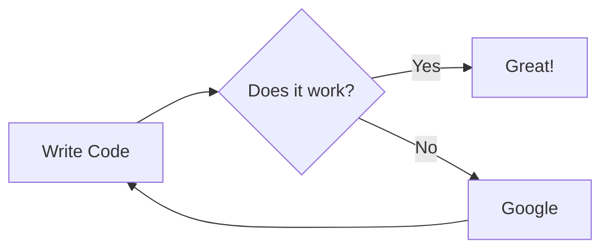

# home-stack

<div class="warning" style='padding:0.1em; background-color:#E9D8FD; color:#69337A'>
<span>
<p style='margin-top:1em; text-align:center'>
<b>Home Project Stack</b></p>
<p style='margin-left:1em;'>
The stack is deployed using Kubernetes cluster enabled using microk8s. microk8s is installed using snap package manger. Package is provided by Canonical (publisher of Ubuntu).<br>
- Resources: quad-core ARMx64 processor with 8GB RAM<br>
- Kernel: GNU/Linux 5.4.0-1058-raspi aarch64<br>
- OS: Ubuntu 20.04.4<br><br>
As of now it is deployed on single node cluster.
</p>
<p style='margin-bottom:1em; margin-right:1em; text-align:right; font-family:Georgia'> <b>- Alok Singh</b> 
</p></span>
</div>

## Table of contents 
<!-- TOC -->
* [home-stack](#home-stack)
  * [Table of contents](#table-of-contents)
    * [Deployment of home-stack Kubernetes Stack](#deployment-of-home-stack-kubernetes-stack)
      * [Create Namespaces](#create-namespaces)
      * [Create ConfigMap](#create-configmap)
      * [Create Secrets](#create-secrets)
      * [Create Network policy](#create-network-policy)
      * [MySQL Service - Pod/Deployment/Service](#mysql-service---poddeploymentservice)
      * [Home API Service - Pod/Deployment/Service](#home-api-service---poddeploymentservice)
    * [Home Auth Service - Pod/Deployment/Service](#home-auth-service---poddeploymentservice)
      * [Home ETL Service - Pod/Statefulset/Service](#home-etl-service---podstatefulsetservice)
      * [Home GIT Commit CronJob](#home-git-commit-cronjob)
      * [Statement Parser Service - Pod/Deployment/Service](#statement-parser-service---poddeploymentservice)
      * [Dashboard Service - Pod/Deployment/Service](#dashboard-service---poddeploymentservice)
      * [Jaeger Service](#jaeger-service)
      * [Delete Stack](#delete-stack)
  * [Kubernetes Dashboard](#kubernetes-dashboard)
    * [Pod/Deployment/Service](#poddeploymentservice)
    * [Kubernetes Metrics Server](#kubernetes-metrics-server)
    * [Ingress](#ingress)
      * [Ingress Controller - Enable Nginx Ingress Controller](#ingress-controller---enable-nginx-ingress-controller)
      * [Ingress](#ingress-1)
  * [RBAC](#rbac)
    * [Enable RBAC](#enable-rbac)
    * [Create roll binding for cluster admin user: alok](#create-roll-binding-for-cluster-admin-user--alok)
    * [Create user alok](#create-user-alok)
      * [Create CSR for user alok](#create-csr-for-user-alok)
      * [Sign User CSR on master node](#sign-user-csr-on-master-node)
      * [Copy User Cert and CA cert](#copy-user-cert-and-ca-cert)
      * [Create Cluster](#create-cluster)
      * [Create User Credentials](#create-user-credentials)
      * [Create User Context](#create-user-context)
      * [Use the context](#use-the-context)
    * [Horizon Autoscaling](#horizon-autoscaling)
      * [Create HorizonTalPodAutoscaler](#create-horizontalpodautoscaler)
      * [Update Scale to 1](#update-scale-to-1)
    * [Miscellaneous commands](#miscellaneous-commands)
      * [Get all](#get-all)
      * [Get Pod Log](#get-pod-log)
      * [Describe a Pod](#describe-a-pod)
      * [Get All Pods under All Namespaces](#get-all-pods-under-all-namespaces)
      * [Describe a spec](#describe-a-spec)
  * [Service Mesh - Istio](#service-mesh---istio)
    * [Install](#install)
  * [Deployment Architecture](#deployment-architecture)
    * [Services](#services)
<!-- TOC -->

### Deployment of home-stack Kubernetes Stack
#### Create Namespaces
```shell
kubectl apply -f yaml/namespace.yaml
```
#### Create ConfigMap
```shell
kubectl apply -f yaml/config-map.yaml
```
#### Create Secrets
```shell
kubectl apply -f yaml/secrets.yaml
```
#### Create Network policy
```shell
kubectl apply -f yaml/networkpolicy.yaml
```
#### MySQL Service - Pod/Deployment/Service
```shell
kubectl apply --validate=true --dry-run=client -f yaml/mysql-service.yaml 
``shell
kubectl apply -f yaml/mysql-service.yaml  --namespace=home-stack
```
```shell
kubectl delete -f yaml/mysql-service.yaml  --namespace=home-stack
```
```shell
kubectl exec -it pod/mysql-0 --namespace home-stack -- mysql -u root -p home-stack
```
```shell
kubectl logs pod/mysql-0 --namespace home-stack
```
```shell
mysql -u root -p home-stack --host 127.0.0.1 --port 32306
```
---
**Note:**
>[Follow the link to configure sqldeveloper on Mac to connect to MySQL server remotely](https://cybercafe.dev/setup-mysql-and-sql-developer-on-macos/ "https://cybercafe.dev/setup-mysql-and-sql-developer-on-macos/")
---
#### Home API Service - Pod/Deployment/Service
```shell
kubectl apply --validate=true --dry-run=client -f yaml/home-api-service.yaml 
```
```shell
kubectl apply -f yaml/home-api-service.yaml  --namespace=home-stack
```
```shell
kubectl delete -f yaml/home-api-service.yaml  --namespace=home-stack
```
```shell
kubectl exec -it pod/home-api-deployment-0 --namespace home-stack -- bash
```
```shell
kubectl exec -it pod/home-api-deployment-0 --namespace home-stack -- tail -f /opt/logs/application.log
```
```shell
kubectl logs pod/home-api-deployment-0 --namespace home-stack
```
```shell
kubectl rollout restart statefulset.apps/home-api-deployment -n home-stack
```
### Home Auth Service - Pod/Deployment/Service
```shell
kubectl apply --validate=true --dry-run=client -f yaml/home-auth-service.yaml 
```
```shell
kubectl apply -f yaml/home-auth-service.yaml  --namespace=home-stack
```
```shell
kubectl delete -f yaml/home-auth-service.yaml  --namespace=home-stack
```
```shell
kubectl exec -it pod/home-auth-deployment-0 --namespace home-stack -- bash
```
```shell
kubectl exec -it pod/home-auth-deployment-0 --namespace home-stack -- tail -f /opt/logs/application.log
```
```shell
kubectl logs pod/home-auth-deployment-0 --namespace home-stack
```
```shell
kubectl rollout restart statefulset.apps/home-api-deployment -n home-stack
```
#### Home ETL Service - Pod/Statefulset/Service
```shell
kubectl apply --validate=true --dry-run=client -f yaml/home-etl-service.yaml 
```
```shell
kubectl apply -f yaml/home-etl-service.yaml  --namespace=home-stack
```
```shell
kubectl delete -f yaml/home-etl-service.yaml  --namespace=home-stack
```
```shell
kubectl exec -it pod/home-etl-deployment-0 --namespace home-stack -- bash
```
```shell
kubectl exec -it pod/home-etl-deployment-0 --namespace home-stack -- tail -f /opt/logs/application.log
```
```shell
kubectl logs pod/home-etl-deployment-0 --namespace home-stack
```
```shell
kubectl rollout restart statefulset.apps/home-api-deployment -n home-stack
```
#### Home GIT Commit CronJob
```shell
kubectl apply --validate=true --dry-run=client -f yaml/git-commit-cronjob.yaml 
```
```shell
kubectl apply -f yaml/git-commit-cronjob.yaml  --namespace=home-stack
```
```shell
kubectl delete -f yaml/git-commit-cronjob.yaml  --namespace=home-stack
```
#### Statement Parser Service - Pod/Deployment/Service
```shell
kubectl apply --validate=true --dry-run=client -f yaml/stmt-parser-service.yaml 
```
```shell
kubectl apply -f yaml/stmt-parser-service.yaml  --namespace=home-stack
```
```shell
kubectl delete -f yaml/stmt-parser-service.yaml  --namespace=home-stack
```
```shell
kubectl exec -it pod/stmtparser-deployment-0 --namespace home-stack -- bash
```
```shell
kubectl exec -it pod/stmtparser-deployment-0 --namespace home-stack -- tail -f /opt/logs/spring-batch.log
```
```shell
kubectl logs pod/stmtparser-deployment-0 --namespace home-stack
```
```shell
kubectl rollout restart statefulset.apps/stmtparser-deployment -n home-stack
```
#### Dashboard Service - Pod/Deployment/Service
```shell
kubectl apply --validate=true --dry-run=client -f yaml/dashboard-service.yaml 
```
```shell
kubectl apply -f yaml/dashboard-service.yaml  --namespace=home-stack
```
```shell
kubectl delete -f yaml/dashboard-service.yaml  --namespace=home-stack
```
```shell
kubectl exec -it deployment.apps/dashboard-deployment --namespace home-stack -- /bin/sh
```
```shell
kubectl logs deployment.apps/dashboard-deployment --namespace home-stack
```
#### Jaeger Service
```shell
kubectl apply --validate=true --dry-run=client -f yaml/jaeger-all-in-one-template.yml 
```
```shell
kubectl apply -f yaml/jaeger-all-in-one-template.yml  --namespace=home-stack
```
```shell
kubectl delete -f yaml/jaeger-all-in-one-template.yml  --namespace=home-stack
```
#### Delete Stack
```shell
kubectl delete namespace home-stack 
```
## Kubernetes Dashboard
### Pod/Deployment/Service
```shell
kubectl apply -f yaml/kubernetes-dashboard.yaml
```
```shell
kubectl delete -f yaml/kubernetes-dashboard.yaml
```
```shell
kubectl get all --namespace kubernetes-dashboard
```
```shell
kubectl apply -f yaml/kubernetes-dashboard-rback-cluster-admin-user.yaml
```
```shell
kubectl create token k8s-dashboard-cluster-admin-user --duration=999999h -n kubernetes-dashboard
```
Note: use this token for Kubernetes Dashboard login

### Kubernetes Metrics Server
```shell
kubectl apply -f yaml/metrix-server.yaml
```
```shell
kubectl delete -f yaml/metrix-server.yaml
```
```shell
kubectl get deployment metrics-server -n kube-system
```
```shell
kubectl top nodes
```
### Ingress
#### Ingress Controller - Enable Nginx Ingress Controller
This will deploy a daemonset nginx-ingress-microk8s-controller
```shell
microk8s enable ingress
```
#### Ingress
```shell
kubectl apply -f yaml/ingress.yaml --namespace=home-stack
```
## RBAC
### Enable RBAC
```
microk8s enable rbac
```
### Create roll binding for cluster admin user: alok
So that remotely cluster opertaion can be performed
```shell
kubectl apply -f yaml/home-user-rback-cluster-admin-user.yaml
```
### Create user alok
#### Create CSR for user alok
```shell
cd ~/cert/k8s
openssl genrsa -out alok.key 2048
openssl req -new -key alok.key -out alok-csr.pem -subj "/CN=alok/O=home-stack/O=ingress"
scp alok-csr.pem alok@jgte:cert/
```
#### Sign User CSR on master node
```
openssl x509 -req -in ~/cert/alok-csr.pem -CA /var/snap/microk8s/current/certs/ca.crt -CAkey /var/snap/microk8s/current/certs/ca.key -CAcreateserial -out ~/cert/alok-crt.pem -days 365
```
#### Copy User Cert and CA cert
```shell
scp alok@jgte:cert/alok-crt.pem ~/cert/k8s
```
```shell
scp alok@jgte:/var/snap/microk8s/current/certs/ca.crt ~/cert/k8s
```
Note: add below entry in /etc/hosts
```
192.168.1.200   jgte kubernetes
```
#### Create Cluster
```shell
kubectl config set-cluster home-cluster --server=https://kubernetes:16443 --certificate-authority=/Users/aloksingh/cert/k8s/ca.crt --embed-certs=true
```
```shell
cat ~/.kube/config
````
#### Create User Credentials
```shell
kubectl config set-credentials alok --client-certificate=/Users/aloksingh/cert/k8s/alok-crt.pem --client-key=/Users/aloksingh/cert/k8s/alok.key --embed-certs=true
```
#### Create User Context
```shell
kubectl config set-context alok-home --cluster=home-cluster --namespace=home-stack --user alok
```
#### Use the context
```shell
kubectl config use-context alok-home
```
### Horizon Autoscaling
#### Create HorizonTalPodAutoscaler
```shell
kubectl autoscale deployment dashboard-deployment --min=2 --max=3 -n home-stack
```
```shell
kubectl get hpa --namespace home-stack
```

#### Update Scale to 1
```shell
kubectl edit hpa dashboard-deployment --namespace home-stack
```
```shell
kubectl scale -n home-stack deployment dashboard-deployment --replicas=1
```

### Miscellaneous commands
#### Get all 
```shell
kubectl get all --all-namespaces
```
#### Get Pod Log
```shell
kubectl logs pod/dashboard-deployment-65cf5b8858-7x8z8 --namespace home-stack
```
#### Describe a Pod
```shell
kubectl describe pod/dashboard-deployment-65cf5b8858-7x8z8  --namespace=home-stack
```
#### Get All Pods under All Namespaces
```shell
kubectl get -A pods
```
#### Describe a spec
```shell
kubectl explain --api-version="batch/v1beta1" cronjobs.spec
```
## Service Mesh - Istio
### Install

---
>To be explored - seems microk8s isteo addon not supported for ARMx64 architecture. Where the same is supported for minikube.
---

## Deployment Architecture


### Services

| Application               | Description                                   | Service Type             | Deployment/StatefulSet/CronJob/DaemonSet | URL                                | Comments                                                                                                                                          |
|---------------------------|-----------------------------------------------|--------------------------|------------------------------------------|------------------------------------|---------------------------------------------------------------------------------------------------------------------------------------------------|
| Home ETL Service          | ETL for bank statement and other sources      | ClusterIP (Headless)     | StatefulSet                              | /home/etl                          | NA                                                                                                                                                |
| Home API Service          | API for Bank/Expense/Tax/Investment/etc...    | ClusterIP                | Deployment                               | /home/api                          | GraalVM based native Image                                                                                                                        |
| Home Dashboard            | ReactJS App on Nginx                          | NodePort                 | Deployment                               | http://jgte:30080  or https://jgte | - For multinode deployment Interface has to be changed to ClusterIP and put behind Ingress - externalTrafficPolicy: Local to disable SNATing      |
| Home GIT Cronjob          | Cronjob to update GIT with uploaded statement | None                     | CronJob                                  | NA                                 | NA                                                                                                                                                |
| Database                  | MySQL                                         | NodePort                 | StatefulSet                              | jdbc:mysql://mysql:3306/home-stack | - NodePort because I want to access SQL from outside of the cluster                                                                               |
| Kubernetes Dashboard      |                                               | LoadBalancer (static IP) | Deployment                               | https://jgte:8443/                 |                                                                                                                                                   |
| Kubernetes Matrix         | Generating resource utilization matrix        | ClusterIP                | Deployment                               | NA                                 |                                                                                                                                                   |
| Kubernetes Matrix Scraper | Matrix scrapper from pods                     | ClusterIP                | Deployment                               | NA                                 |                                                                                                                                                   |
| Jaeger Dashboard          |                                               | NodePort                 | Deployment                               | http://jgte:31686/                 |                                                                                                                                                   |
| Ingress Controller        | Nginx Ingress Controller                      | NodePort                 | DaemonSet                                | Port: 443                          | API/ETL/Dashboard are behind Nginx but still we have Dashboard accessible directly (from mobile cant access host name - require local DNS server) |

