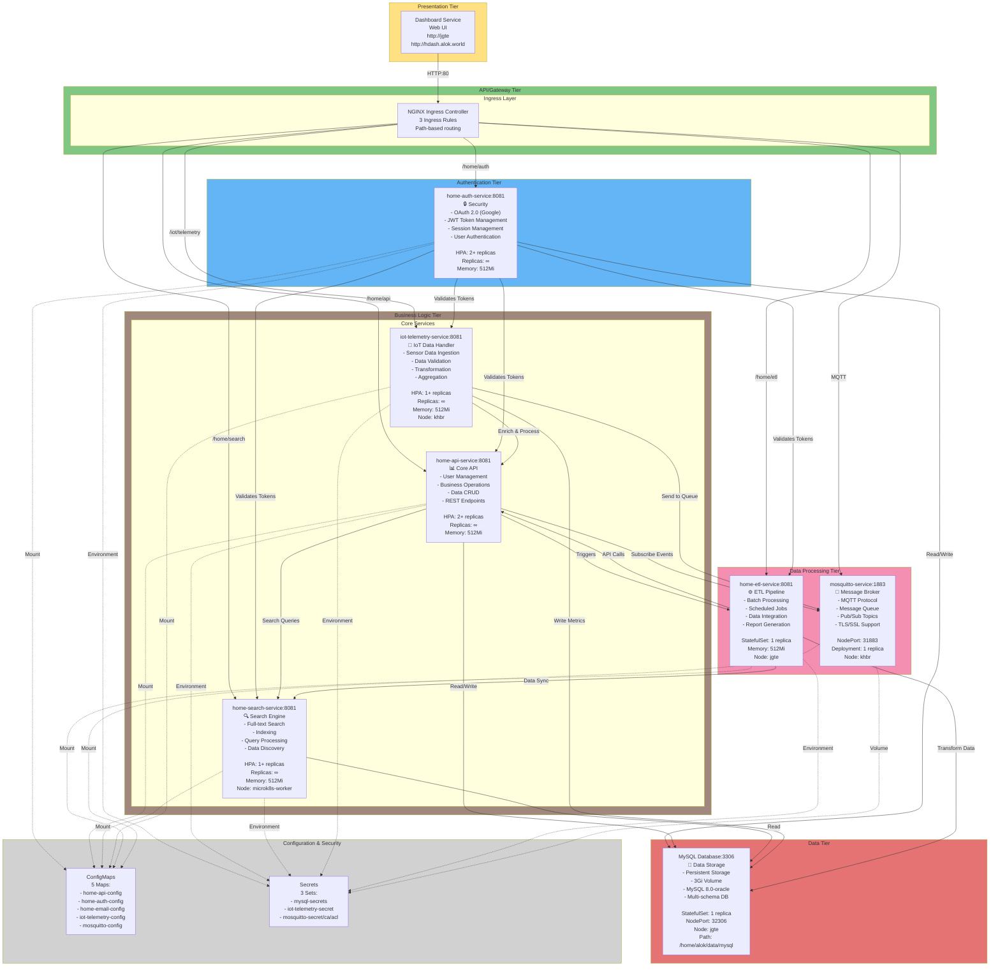
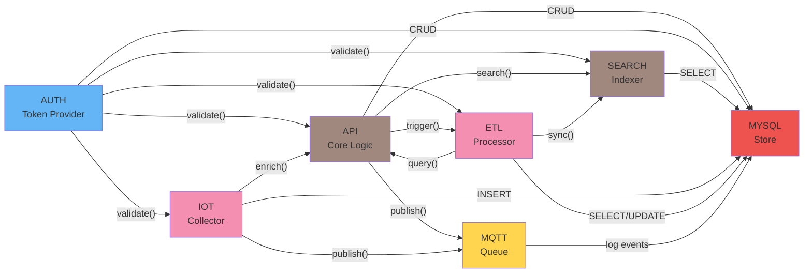
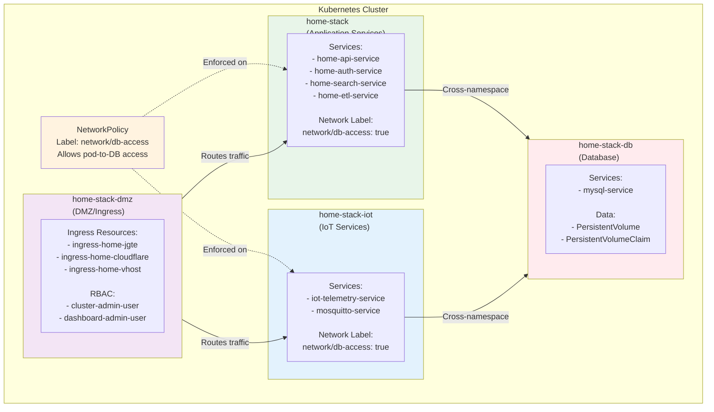
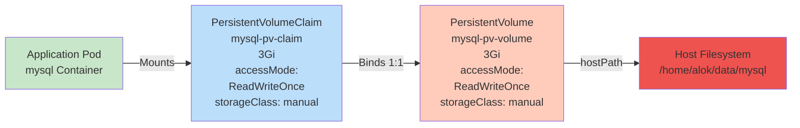

# Kubernetes Application Layers & Dependencies

## Application Stack Diagram



## Service Dependencies Map



## Namespace Isolation



## Pod Lifecycle & Health Checks

```
Startup Flow:
┌─────────────────────────────────────────────────┐
│ 1. Pod Created & Container Started               │
│    └─ Image pulled (Always)                      │
│    └─ Container entrypoint executed              │
└─────────────────────────────────────────────────┘
                      ↓
┌─────────────────────────────────────────────────┐
│ 2. initialDelaySeconds (varies by service)       │
│    ├─ API:    5-10s (quick startup)              │
│    ├─ AUTH:   60-90s (slower startup)            │
│    ├─ SEARCH: 60s                                │
│    └─ IOT:    60s                                │
└─────────────────────────────────────────────────┘
                      ↓
┌─────────────────────────────────────────────────┐
│ 3. Liveness Probe Checks (Ongoing)               │
│    └─ /actuator/health/liveness endpoint         │
│    └─ Period: 10-60s (per service)               │
│    └─ Timeout: 5s                                │
│    └─ Failure Threshold: 5-10 attempts           │
│    └─ Action: Restart container if fails         │
└─────────────────────────────────────────────────┘
                      ↓
┌─────────────────────────────────────────────────┐
│ 4. Readiness Probe Checks (Ongoing)              │
│    └─ /actuator/health/readiness endpoint        │
│    └─ Period: 30-60s (per service)               │
│    └─ Timeout: 5s                                │
│    └─ Failure Threshold: 3-10 attempts           │
│    └─ Action: Remove from Service LB if fails    │
└─────────────────────────────────────────────────┘
                      ↓
┌─────────────────────────────────────────────────┐
│ 5. Pod Ready (Receives Traffic)                  │
│    └─ Service routes requests to this pod        │
│    └─ Continues health checks                    │
│    └─ Can be scaled by HPA                       │
└─────────────────────────────────────────────────┘
                      ↓
┌─────────────────────────────────────────────────┐
│ 6. Termination (Graceful)                        │
│    ├─ SIGTERM signal sent                        │
│    ├─ gracePeriod: 30s (default)                 │
│    ├─ Service stops routing traffic              │
│    └─ Application cleanups connections           │
└─────────────────────────────────────────────────┘
```

## Storage Architecture



## Configuration Injection Methods

### 1. Environment Variables (Secrets)
```yaml
env:
  - name: SPRING_DATASOURCE_USERNAME
    valueFrom:
      secretKeyRef:
        name: mysql-secrets
        key: stmt-user-name
```

### 2. Volume Mounts (TLS Certificates)
```yaml
volumeMounts:
  - name: iot-telemetry-secret
    mountPath: "/etc/jks"
    readOnly: true
```

### 3. ConfigMapRef (Bulk Configuration)
```yaml
envFrom:
  - configMapRef:
      name: iot-telemetry-config
```

## Key Characteristics

| Aspect | Details |
|--------|---------|
| **Cluster Type** | Kubernetes (MicroK8s or similar) |
| **Deployment Pattern** | Microservices with service mesh-less architecture |
| **Scaling Strategy** | HPA for stateless services, Fixed replicas for stateful |
| **Storage** | StatefulSets with hostPath PV (single node) |
| **Security** | Network policies, Secrets, RBAC |
| **HA Approach** | Multi-node cluster with affinity rules |
| **Observability** | Spring Boot Actuator endpoints for health |
| **Update Strategy** | Rolling updates for zero-downtime deployments |

## Critical Dependencies

1. **External Services**
   - Google OAuth for authentication
   - CloudFlare DNS for domain routing

2. **Internal Dependencies**
   - All services depend on MySQL
   - Auth service is authentication backbone
   - MQTT broker for IoT communication

3. **Infrastructure**
   - Persistent storage (local path provisioner)
   - Ingress controller (NGINX)
   - Network policies
   - RBAC configuration
