# Kubernetes Architecture - Home Stack

## System Overview

```mermaid
graph TB
    subgraph External["External Access"]
        DNS["DNS Entries"]
        CF["CloudFlare<br/>hdash.alok.world"]
    end

    subgraph K8S["Kubernetes Cluster"]
        subgraph DMZ["home-stack-dmz Namespace<br/>(DMZ Zone)"]
            ING1["Ingress: ingress-home-jgte<br/>(jgte Host)"]
            ING2["Ingress: ingress-home-cloudflare<br/>(hdash.alok.world)"]
            ING3["Ingress: ingress-home-vhost<br/>(alok-home.com)"]
            DASHSVC["dashboard-service:80"]
            DFLTBK["defaultbackend:80"]
        end

        subgraph HS["home-stack Namespace<br/>(Main Services)"]
            APISVC["Service: home-api-service:8081"]
            AUTHSVC["Service: home-auth-service:8081"]
            SEARCHSVC["Service: home-search-service:8081"]
            ETLSVC["Service: home-etl-service:8081"]
            
            APIDEP["Deployment: home-api<br/>Replicas: HPA Controlled"]
            AUTHDEP["Deployment: home-auth<br/>Replicas: HPA Controlled"]
            SEARCHDEP["Deployment: home-search<br/>Replicas: HPA Controlled"]
            ETLDEP["StatefulSet: home-etl<br/>Replicas: 1"]
        end

        subgraph IOT["home-stack-iot Namespace<br/>(IoT Services)"]
            IOTHSVC["Service: iot-telemetry-service:8081"]
            MQSVC["Service: mosquitto-service:1883<br/>NodePort: 31883"]
            
            IOTHDEP["Deployment: iot-telemetry<br/>Replicas: HPA Controlled"]
            MQDEP["Deployment: mosquitto<br/>Replicas: 1"]
        end

        subgraph DB["home-stack-db Namespace<br/>(Database)"]
            MYSQLSVC["Service: mysql:3306<br/>NodePort: 32306"]
            MYSQLSS["StatefulSet: mysql<br/>Replicas: 1"]
            PVC["PVC: mysql-pv-claim<br/>3Gi Storage"]
            PV["PV: mysql-pv-volume<br/>(/home/alok/data/mysql)"]
        end

        subgraph CM["Configuration & Secrets"]
            CFG1["ConfigMap: home-api-config"]
            CFG2["ConfigMap: home-auth-config"]
            CFG3["ConfigMap: home-email-config"]
            CFG4["ConfigMap: iot-telemetry-config"]
            CFG5["ConfigMap: mosquitto-config"]
            SEC1["Secret: mysql-secrets"]
            SEC2["Secret: iot-telemetry-secret"]
            SEC3["Secret: mosquitto-secret/ca/acl"]
        end
    end

    External -->|Requests| ING2
    ING2 -->|Route /| DASHSVC
    ING2 -->|Route /home/api/actuator| DFLTBK
    
    ING3 -->|Route /home/api| APISVC
    ING3 -->|Route /home/auth| AUTHSVC
    ING3 -->|Route /home/search| SEARCHSVC
    ING3 -->|Route /home/etl| ETLSVC
    
    APISVC --> APIDEP
    AUTHSVC --> AUTHDEP
    SEARCHSVC --> SEARCHDEP
    ETLSVC --> ETLDEP
    
    IOTHSVC --> IOTHDEP
    MQSVC --> MQDEP
    
    MYSQLSVC --> MYSQLSS
    MYSQLSS --> PVC
    PVC --> PV
    
    APIDEP -->|Uses| CFG1
    APIDEP -->|Uses| SEC1
    AUTHDEP -->|Uses| CFG2
    AUTHDEP -->|Uses| SEC1
    SEARCHDEP -->|Uses| CFG3
    SEARCHDEP -->|Uses| SEC1
    ETLDEP -->|Uses| CFG1
    ETLDEP -->|Uses| SEC1
    
    IOTHDEP -->|Uses| CFG4
    IOTHDEP -->|Uses| SEC1
    IOTHDEP -->|Uses| SEC2
    MQDEP -->|Uses| CFG5
    MQDEP -->|Uses| SEC3
    
    APIDEP -->|DB Access| MYSQLSVC
    AUTHDEP -->|DB Access| MYSQLSVC
    SEARCHDEP -->|DB Access| MYSQLSVC
    ETLDEP -->|DB Access| MYSQLSVC
    IOTHDEP -->|DB Access| MYSQLSVC

    style DMZ fill:#FFE5B4
    style HS fill:#B4E5FF
    style IOT fill:#B4FFB4
    style DB fill:#FFB4B4
    style CM fill:#F0F0F0
    style External fill:#CCCCCC
```

## Key Architecture Components

### 1. **Ingress Layer (DMZ Namespace)**
- **Ingress Controllers**: Route external traffic to internal services
  - `ingress-home-jgte`: Local hostname routing
  - `ingress-home-cloudflare`: External DNS (hdash.alok.world)
  - `ingress-home-vhost`: Domain-based routing (alok-home.com)
- **Features**: Proxy timeouts, request body size limits

### 2. **Application Services (home-stack Namespace)**
- **home-api-service** (Port 8081)
  - Core API service
  - HPA-controlled replicas
  - DB Access: Yes
  - Resource Limits: 512Mi RAM, 200m CPU

- **home-auth-service** (Port 8081)
  - Authentication & Authorization
  - OAuth Google integration
  - HPA-controlled replicas
  - JWT token management

- **home-search-service** (Port 8081)
  - Search & indexing service
  - Node affinity to microk8s-worker
  - HPA-controlled replicas

- **home-etl-service** (Port 8081)
  - ETL (Extract, Transform, Load) service
  - StatefulSet (1 replica)
  - Pinned to jgte node
  - Long-running background jobs

### 3. **IoT Services (home-stack-iot Namespace)**
- **iot-telemetry-service** (Port 8081)
  - IoT data collection & telemetry
  - Pinned to khbr node
  - JKS certificate management
  - Mosquitto CA certificates

- **mosquitto-service** (Port 1883)
  - MQTT message broker
  - NodePort: 31883 (external access)
  - TLS/SSL support
  - ACL (Access Control List) configuration

### 4. **Data Layer (home-stack-db Namespace)**
- **MySQL Database** (Port 3306)
  - StatefulSet deployment
  - 3Gi persistent storage
  - Shared by all services
  - NodePort: 32306 (external access)
  - Pinned to jgte node

### 5. **Configuration Management**
- **ConfigMaps**
  - Database connection URLs
  - Logging levels
  - Service-specific configurations
  - MQTT broker settings

- **Secrets**
  - Database credentials
  - JWT secrets
  - SSL/TLS certificates
  - OAuth credentials

## Network Isolation & Security

### Network Policies
- Label-based network control: `network/db-access: "true"`
- Services requiring database access explicitly labeled

### Node Affinities
- **jgte node**: MySQL, home-etl (stateful workloads)
- **khbr node**: iot-telemetry, mosquitto (IoT services)
- **Flexible scheduling**: home-api, home-auth, home-search

## Health Checks
All services implement:
- **Liveness Probe**: Spring Boot `/actuator/health/liveness` endpoint
- **Readiness Probe**: Spring Boot `/actuator/health/readiness` endpoint
- Automatic restart on failure
- Gradual health check escalation

## Scaling Strategy
- **HPA (Horizontal Pod Autoscaler)**: home-api, home-auth, home-search
- **StatefulSets**: mysql, home-etl (stateful workloads)
- **Node Affinity**: Distribute workloads intelligently
