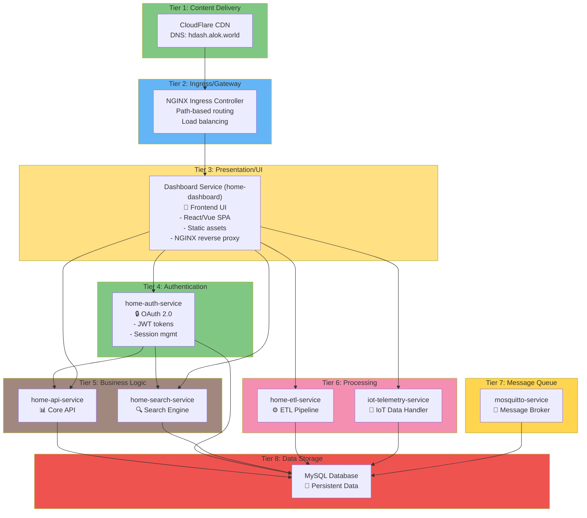
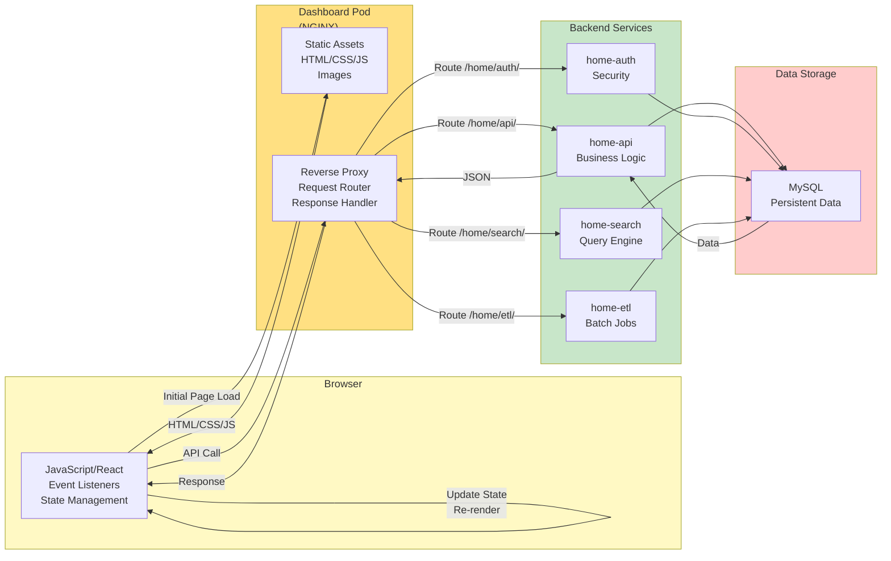

# Kubernetes Full Stack Architecture - With Dashboard UI

## Complete System Architecture (Updated)

```mermaid
graph TB
    subgraph External["External Access"]
        WEB["🌐 Web Browser<br/>HTTPS"]
        MOBILE["📱 Mobile Client<br/>HTTPS"]
    end

    subgraph CDN["DNS & CDN"]
        CF["CloudFlare<br/>hdash.alok.world<br/>alok-home.com"]
        LOCAL["Local DNS<br/>jgte"]
    end

    subgraph K8S["Kubernetes Cluster"]
        subgraph DMZ["home-stack-dmz Namespace<br/>(DMZ/Ingress Zone)"]
            ING["NGINX Ingress Controller<br/>External Traffic Router<br/>3 Ingress Rules"]
            DASH_SVC["dashboard-service:80<br/>Frontend UI"]
            DASH_POD["Dashboard Pod<br/>alokkusingh/home-dashboard<br/>NGINX + Frontend<br/>Reverse Proxy"]
            DASH_CFG["ConfigMap: nginx-conf<br/>- Upstream definitions<br/>- Reverse proxy rules<br/>- Logging config"]
        end

        subgraph HS["home-stack Namespace<br/>(Application Services)"]
            APISVC["Service: home-api-service:8081"]
            AUTHSVC["Service: home-auth-service:8081"]
            SEARCHSVC["Service: home-search-service:8081"]
            ETLSVC["Service: home-etl-service:8081"]
            
            APIDEP["Deployment: home-api<br/>HPA Controlled"]
            AUTHDEP["Deployment: home-auth<br/>HPA Controlled"]
            SEARCHDEP["Deployment: home-search<br/>HPA Controlled"]
            ETLDEP["StatefulSet: home-etl<br/>Replicas: 1"]
        end

        subgraph IOT["home-stack-iot Namespace<br/>(IoT Services)"]
            IOTHSVC["Service: iot-telemetry-service:8081"]
            MQSVC["Service: mosquitto-service:1883<br/>NodePort: 31883"]
            
            IOTHDEP["Deployment: iot-telemetry<br/>HPA Controlled"]
            MQDEP["Deployment: mosquitto<br/>Replicas: 1"]
        end

        subgraph DB["home-stack-db Namespace<br/>(Database)"]
            MYSQLSVC["Service: mysql:3306<br/>NodePort: 32306"]
            MYSQLSS["StatefulSet: mysql<br/>Replicas: 1"]
            PVC["PVC: mysql-pv-claim<br/>3Gi Storage"]
        end

        subgraph CM["Configuration & Secrets"]
            CFG1["ConfigMap: home-api-config"]
            CFG2["ConfigMap: home-auth-config"]
            CFG3["ConfigMap: home-email-config"]
            CFG4["ConfigMap: iot-telemetry-config"]
            CFG5["ConfigMap: mosquitto-config"]
            CFG6["ConfigMap: nginx-conf<br/>(Dashboard config)"]
            SEC1["Secret: mysql-secrets"]
            SEC2["Secret: iot-telemetry-secret"]
            SEC3["Secret: mosquitto-secret/ca/acl"]
        end
    end

    %% External to DNS
    WEB -->|HTTPS| CF
    MOBILE -->|HTTPS| CF
    LOCAL -->|HTTP| LOCAL

    %% DNS to Ingress
    CF -->|Route /| ING
    LOCAL -->|Route /| ING

    %% Ingress to Dashboard
    ING -->|All Traffic| DASH_SVC
    DASH_SVC -->|Load Balance| DASH_POD
    DASH_POD -.->|Mount Config| DASH_CFG

    %% Dashboard to Backend Services
    DASH_POD -->|/home/api/| APISVC
    DASH_POD -->|/home/auth/| AUTHSVC
    DASH_POD -->|/home/search/| SEARCHSVC
    DASH_POD -->|/home/etl/| ETLSVC

    %% Services to Deployments
    APISVC --> APIDEP
    AUTHSVC --> AUTHDEP
    SEARCHSVC --> SEARCHDEP
    ETLSVC --> ETLDEP

    IOTHSVC --> IOTHDEP
    MQSVC --> MQDEP

    MYSQLSVC --> MYSQLSS

    %% Configuration
    APIDEP -.->|Uses| CFG1
    AUTHDEP -.->|Uses| CFG2
    SEARCHDEP -.->|Uses| CFG3
    ETLDEP -.->|Uses| CFG1
    IOTHDEP -.->|Uses| CFG4
    MQDEP -.->|Uses| CFG5

    %% Secrets
    APIDEP -.->|Uses| SEC1
    AUTHDEP -.->|Uses| SEC1
    SEARCHDEP -.->|Uses| SEC1
    ETLDEP -.->|Uses| SEC1
    IOTHDEP -.->|Uses| SEC1
    IOTHDEP -.->|Uses| SEC2
    MQDEP -.->|Uses| SEC3

    %% Database Access
    APIDEP -->|DB| MYSQLSVC
    AUTHDEP -->|DB| MYSQLSVC
    SEARCHDEP -->|DB| MYSQLSVC
    ETLDEP -->|DB| MYSQLSVC
    IOTHDEP -->|DB| MYSQLSVC

    style DMZ fill:#FFE082
    style DASH_POD fill:#FFF9C4
    style HS fill:#B4E5FF
    style IOT fill:#B4FFB4
    style DB fill:#FFB4B4
    style CM fill:#F0F0F0
    style External fill:#CCCCCC
```



## Presentation Tier - Dashboard Service

### Dashboard Role in Architecture

The **dashboard-service** is the entry point for all user interactions:

```
┌─────────────────────────────────────────────────────────┐
│          PRESENTATION LAYER                             │
│                                                         │
│  Web Browser/Mobile Client                             │
│         │                                               │
│         ├─► Static Assets                              │
│         │   - HTML/CSS/JavaScript                      │
│         │   - React/Vue Frontend                       │
│         │                                               │
│         └─► Dynamic Content                            │
│             - AJAX/REST API Calls                      │
│             - Real-time Updates                        │
│             - User Interactions                        │
│                                                         │
│  Reverse Proxy Router (NGINX)                          │
│         │                                               │
│         ├─► /home/api/* → home-api-service            │
│         ├─► /home/auth/* → home-auth-service          │
│         ├─► /home/search/* → home-search-service      │
│         └─► /home/etl/* → home-etl-service            │
│                                                         │
└─────────────────────────────────────────────────────────┘
              ↓
┌─────────────────────────────────────────────────────────┐
│          APPLICATION LAYER                              │
│  Backend Services (API, Auth, Search, ETL)             │
└─────────────────────────────────────────────────────────┘
              ↓
┌─────────────────────────────────────────────────────────┐
│          DATA LAYER                                     │
│  MySQL Database                                        │
└─────────────────────────────────────────────────────────┘
```

## Updated 8-Tier Architecture Stack



## Service Routing Summary

| Entry Point | Ingress Rule | Service | Port | Purpose |
|-------------|--------------|---------|------|---------|
| **hdash.alok.world** | `/` | dashboard-service | 80 | Web UI |
| **hdash.alok.world** | `/home/api/actuator` | defaultbackend | 80 | Health check |
| **hdash.alok.world** | `/home/etl/actuator` | defaultbackend | 80 | Health check |
| **hdash.alok.world** | `/home/auth/actuator` | defaultbackend | 80 | Health check |
| **alok-home.com** | `/` | dashboard-service | 80 | Web UI |
| **alok-home.com** | `/home/api` | home-api-service | 8081 | API |
| **alok-home.com** | `/home/auth` | home-auth-service | 8081 | Auth |
| **alok-home.com** | `/home/search` | home-search-service | 8081 | Search |
| **alok-home.com** | `/home/etl` | home-etl-service | 8081 | ETL |
| **Local: jgte** | `/` | dashboard-service | 80 | Web UI |

## User Journey Flow

```
1. USER ACCESSES DASHBOARD
   └─ Browser: https://hdash.alok.world/
   └─ CloudFlare resolves to cluster IP
   └─ Request reaches NGINX Ingress

2. INGRESS ROUTES REQUEST
   └─ Ingress rule matches: /
   └─ Routes to: dashboard-service:80
   └─ Service load balances to dashboard pod

3. DASHBOARD POD SERVES UI
   └─ NGINX serves static frontend files
   └─ Browser receives HTML/CSS/JavaScript
   └─ Frontend app initializes (React/Vue)

4. USER INTERACTS WITH DASHBOARD
   └─ User clicks button / submits form
   └─ Frontend app makes API request
   └─ Example: GET /home/api/users

5. DASHBOARD REVERSE PROXIES REQUEST
   └─ NGINX intercepts request on /home/api/
   └─ Looks up upstream: home-api-service:8081
   └─ Forwards request to backend service

6. BACKEND SERVICE PROCESSES
   └─ home-api-service receives request
   └─ Authenticates via home-auth-service
   └─ Queries database for user data
   └─ Returns JSON response

7. RESPONSE FLOWS BACK
   └─ home-api-service sends response to NGINX
   └─ NGINX proxies response to frontend
   └─ Frontend receives JSON data
   └─ UI updates with new information

8. USER SEES RESULTS
   └─ Frontend renders updated dashboard
   └─ User interacts with displayed data
   └─ Cycle repeats for each action
```

## Component Interaction Diagram



## Dashboard + Backend Communication

### Request Pattern
```bash
# Frontend makes AJAX request
fetch('/home/api/users')
  .then(response => response.json())
  .then(data => {
    // Update UI with data
  })

# NGINX Reverse Proxy Process:
# 1. Request: GET /home/api/users
# 2. NGINX matches: location /home/api/
# 3. Upstream: home-api-service.home-stack:8081
# 4. Proxy URL: http://home-api-service:8081/users
# 5. Response: home-api sends JSON
# 6. NGINX forwards to browser
# 7. Browser JavaScript handles response
```

### Connection Pooling
```yaml
NGINX Configuration:
upstream home-api {
  server home-api-service.home-stack.svc.cluster.local:8081;
  keepalive 30;  # Maintain up to 30 persistent connections
}

Benefits:
- Reduces TCP connection overhead
- Faster request/response cycles
- Better throughput
- Connection reuse across requests
```

## Key Architectural Decisions

| Decision | Reasoning |
|----------|-----------|
| Dashboard in DMZ | Isolate frontend from backend services |
| Single Dashboard Replica | UI state-less, no need for multi-instance |
| NGINX Reverse Proxy | Unified API gateway, connection pooling, logging |
| ClusterIP Service | No external access needed (all via Ingress) |
| ConfigMap for NGINX | Manage configuration separately from image |
| Upstream Definitions | Service discovery via Kubernetes DNS |
| No Health Checks | NGINX auto-responds on port 80 (stateless) |

## Deployment Advantages

✅ **Separation of Concerns**: Frontend, Backend, Data layers isolated  
✅ **Scalability**: Backend services scale independently via HPA  
✅ **Security**: DMZ namespace restricts frontend to internal communication  
✅ **Performance**: NGINX connection pooling optimizes backend communication  
✅ **Maintainability**: Configuration changes via ConfigMap (no image rebuild)  
✅ **Monitoring**: NGINX logs all request/response details  
✅ **Availability**: Ingress provides multiple entry points  

## Summary

The **dashboard-service** acts as:
1. **Presentation Layer** - Serves web UI to users
2. **API Gateway** - Routes frontend requests to backend services
3. **Reverse Proxy** - Proxies API calls from frontend to microservices
4. **Load Balancer** - Distributes NGINX connections efficiently
5. **Request Logger** - Tracks all frontend-to-backend communication

This creates a clean separation between the user-facing interface and the backend business logic, allowing independent development, deployment, and scaling of each layer.
