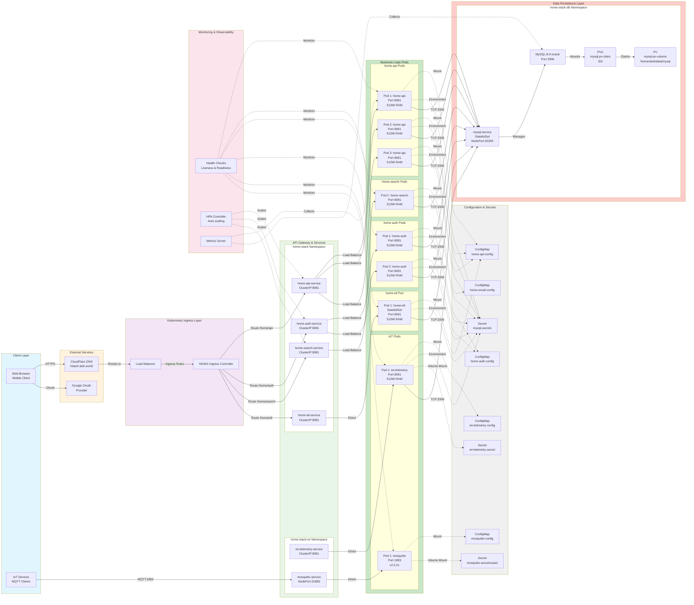

# Kubernetes Component Architecture - Home Stack

## Detailed Component Diagram



## Component Details

### Ingress Layer
| Component | Type | Purpose |
|-----------|------|---------|
| NGINX Ingress Controller | Service Mesh | Routes external HTTP/HTTPS traffic |
| Load Balancer | Network | Distributes load across ingress controllers |
| Ingress Rules | K8s Resource | Define hostname-based routing rules |

### API Services
| Service | Port | Deployment Type | Replicas | Node Affinity |
|---------|------|-----------------|----------|--------------|
| home-api-service | 8081 | Deployment | HPA (2-N) | None (flexible) |
| home-auth-service | 8081 | Deployment | HPA (2-N) | None (flexible) |
| home-search-service | 8081 | Deployment | HPA (2-N) | microk8s-worker |
| home-etl-service | 8081 | StatefulSet | 1 | jgte |
| iot-telemetry-service | 8081 | Deployment | HPA (1-N) | khbr |
| mosquitto-service | 1883 | Deployment | 1 | khbr |

### Pod Specifications
```yaml
Resources per Pod:
  CPU:
    Request: 100-200m
    Limit: Unbounded

  Memory:
    Request: 256-512Mi
    Limit: 512Mi

Health Checks:
  Liveness Probe:
    - Endpoint: /actuator/health/liveness
    - InitialDelay: 5-60s
    - Period: 10-60s
    - Timeout: 5s
    - FailureThreshold: 5-10

  Readiness Probe:
    - Endpoint: /actuator/health/readiness
    - InitialDelay: 10-90s
    - Period: 30-60s
    - Timeout: 5s
    - FailureThreshold: 3-10

Image Pull Policy: Always
Volume Mounts: Timezone config (/usr/share/zoneinfo/Asia/Kolkata)
```

### Database Layer
- **Type**: MySQL 8.0-oracle
- **Deployment**: StatefulSet (persistent state)
- **Storage**: 3Gi PersistentVolume
- **Location**: /home/alok/data/mysql
- **Access**: ClusterIP (internal) + NodePort:32306 (external)
- **Node Pinning**: jgte (single node database)

### Configuration Management
- **ConfigMaps**: 5 maps for different services
- **Secrets**: 3 secret sets for:
  - Database credentials
  - IoT certificates
  - MQTT TLS/ACL
- **Injection Methods**:
  - Environment variables
  - Volume mounts
  - ConfigMapRef (bulk loading)

### Auto-scaling Strategy
- **HPA Configuration**:
  - Targets: home-api, home-auth, home-search
  - Metrics: CPU & Memory
  - Defined in: home-hpa.yaml

### Monitoring & Observability
- **Health Endpoints**: Spring Boot Actuator
- **Metrics Server**: Collects resource metrics
- **Horizontal Pod Autoscaler**: Responds to metrics
- **No explicit Service Mesh**: Direct pod-to-pod communication
