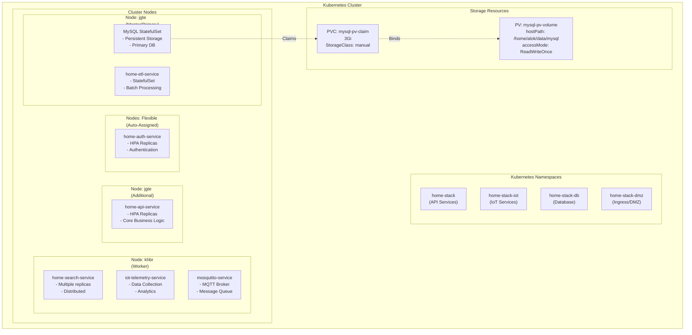
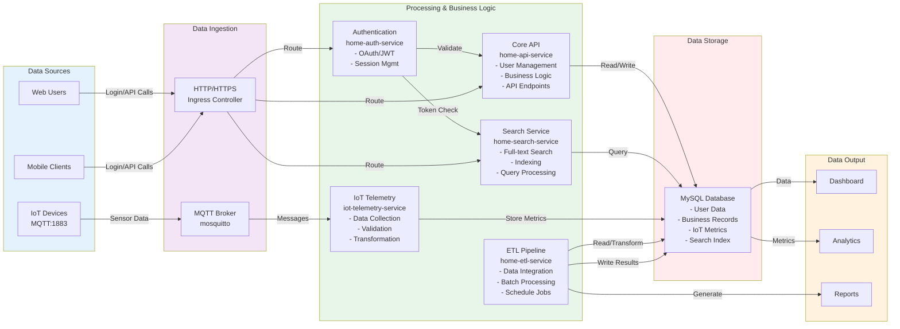
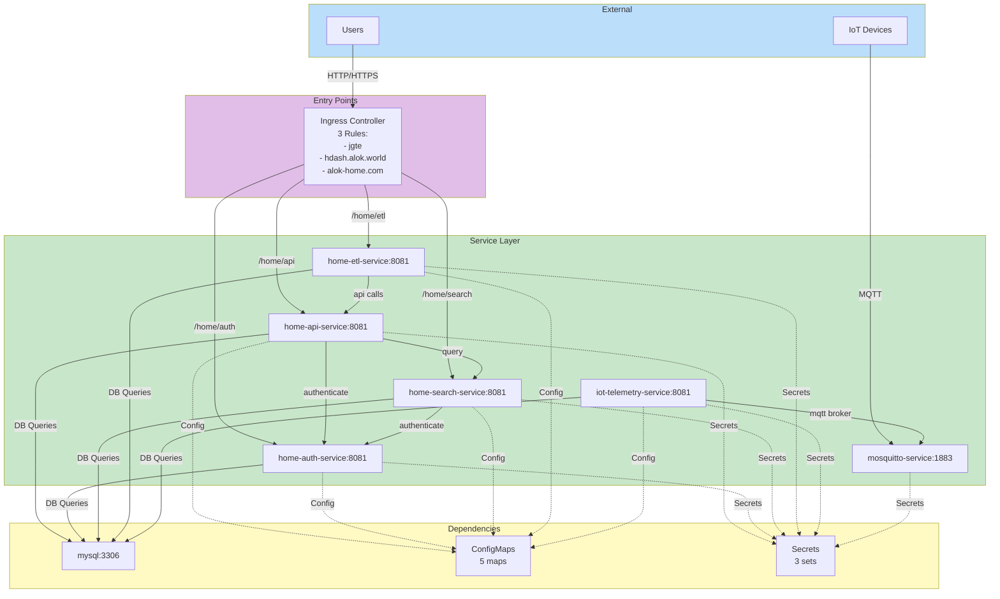

# Kubernetes Deployment Details & Data Flow

## Deployment Topology



## Data Flow Architecture



## Service Communication Map



## Port & Network Mapping

### Internal Communication
```
Within Cluster:
├── home-api-service.home-stack:8081
├── home-auth-service.home-stack:8081
├── home-search-service.home-stack:8081
├── home-etl-service.home-stack:8081
├── iot-telemetry-service.home-stack-iot:8081
├── mosquitto-service.home-stack-iot:1883
└── mysql.home-stack-db:3306
```

### External Access
```
NodePort Services:
├── MQTT Broker:       node:31883  -> mosquitto:1883
├── MySQL Database:    node:32306  -> mysql:3306
└── HTTP/HTTPS:        LoadBalancer -> Ingress:80/443
```

### DNS Resolution
```
Internal (ClusterDNS):
├── home-api-service.home-stack.svc.cluster.local:8081
├── home-auth-service.home-stack.svc.cluster.local:8081
├── home-search-service.home-stack.svc.cluster.local:8081
├── home-etl-service.home-stack.svc.cluster.local:8081
├── iot-telemetry-service.home-stack-iot.svc.cluster.local:8081
├── mosquitto-service.home-stack-iot.svc.cluster.local:1883
└── mysql.home-stack-db.svc.cluster.local:3306

External (CloudFlare):
├── hdash.alok.world:443 -> Ingress LoadBalancer
└── alok-home.com:443    -> Ingress LoadBalancer
```

## Scaling & Resource Allocation

### HPA Configuration
```
home-api-service:
├── Min Replicas:    2
├── Max Replicas:    N (defined in home-hpa.yaml)
├── CPU Target:      ~80%
└── Memory Target:   ~80%

home-auth-service:
├── Min Replicas:    2
├── Max Replicas:    N
├── CPU Target:      ~80%
└── Memory Target:   ~80%

home-search-service:
├── Min Replicas:    1
├── Max Replicas:    N
├── CPU Target:      ~80%
└── Memory Target:   ~80%
```

### Resource Requests & Limits
```
Standard Spring Boot Service:
├── CPU:
│   ├── Request:    100-200m
│   └── Limit:      Not enforced (burstable)
├── Memory:
│   ├── Request:    256Mi
│   └── Limit:      512Mi
└── Image:          Always pulled (latest)

Stateful Services:
├── home-etl:       1 fixed replica
└── mysql:          1 fixed replica
```

## Network Security

### Network Policies
- **Label-based access**: `network/db-access: "true"`
- **Services with DB access**: All application services

### Service Types
```
ClusterIP (Internal):
├── home-api-service
├── home-auth-service
├── home-search-service
├── home-etl-service
├── iot-telemetry-service
└── mysql (primary)

NodePort (External):
├── mosquitto-service:1883  (31883)
└── mysql:3306              (32306)
```

## Deployment Strategy

### Rolling Updates
```
Update Strategy: RollingUpdate
├── All services use rolling updates
├── Pods replaced gradually
├── Old pods terminate after new ready
└── Zero-downtime deployments
```

### Health Verification
```
Service Startup Sequence:
1. Pod starts container
2. Wait initialDelaySeconds
3. First liveness probe
4. First readiness probe
5. Service traffic enabled (readiness pass)
6. Periodic health checks continue
7. Restart on liveness failure
8. Remove from service on readiness failure
```
