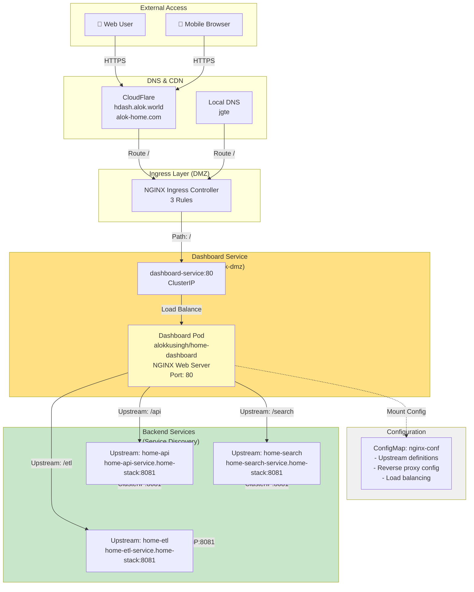
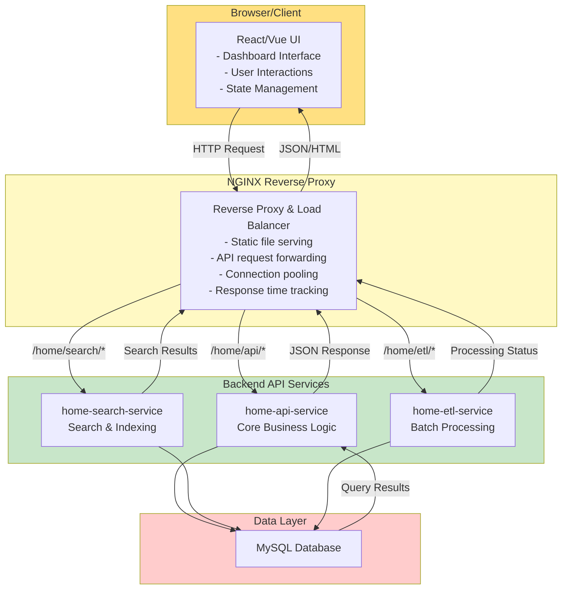
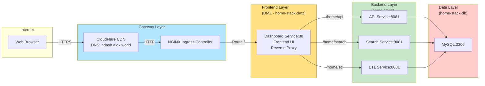

# Kubernetes Dashboard UI - Frontend Architecture

## Dashboard Service Overview



## Dashboard Architecture Components

### 1. Dashboard Service Definition

```yaml
Service Name:     dashboard-service
Namespace:        home-stack-dmz (DMZ Zone)
Type:             ClusterIP (internal only)
Port:             80 (HTTP)

Container Image:  alokkusingh/home-dashboard
Image Pull:       Always (latest)
Port Mapping:     Container 80 → Service 80

Replicas:         1 (Fixed)
Strategy:         Standard Deployment

Node Affinity:
  Preferred:      microk8s-worker
  Weight:         1

Configuration:
  - Mounted ConfigMap: nginx-conf
  - Mount Path: /etc/nginx/nginx.conf
  - Read-Only: true
```

### 2. Dashboard Pod Architecture

```
┌────────────────────────────────────────────────────────┐
│        Dashboard Pod (home-dashboard)                  │
│                                                        │
│  ┌──────────────────────────────────────────────────┐ │
│  │  NGINX Web Server (Port 80)                      │ │
│  │                                                  │ │
│  │  ┌────────────────────────────────────────────┐ │ │
│  │  │  React/Vue Frontend Application            │ │ │
│  │  │  - Dashboard UI                            │ │ │
│  │  │  - User Interface                          │ │ │
│  │  │  - Client-side routing                     │ │ │
│  │  └────────────────────────────────────────────┘ │ │
│  │                                                  │ │
│  │  ┌────────────────────────────────────────────┐ │ │
│  │  │  NGINX Reverse Proxy Configuration         │ │ │
│  │  │  - /home/api → home-api-service:8081       │ │ │
│  │  │  - /home/search → home-search-service:8081 │ │ │
│  │  │  - /home/etl → home-etl-service:8081       │ │ │
│  │  │  - Keepalive connections: 30               │ │ │
│  │  │  - Connection pooling                      │ │ │
│  │  └────────────────────────────────────────────┘ │ │
│  │                                                  │ │
│  │  ┌────────────────────────────────────────────┐ │ │
│  │  │  Logging & Monitoring                      │ │ │
│  │  │  - Access logs: /var/log/nginx/access.log  │ │ │
│  │  │  - Error logs: /var/log/nginx/error.log    │ │ │
│  │  │  - Response time tracking                  │ │ │
│  │  └────────────────────────────────────────────┘ │ │
│  └──────────────────────────────────────────────────┘ │
│                                                        │
│  ┌──────────────────────────────────────────────────┐ │
│  │  Volume Mounts:                                  │ │
│  │  - nginx.conf (from ConfigMap: nginx-conf)      │ │
│  │  - Timezone: /etc/localtime (optional)          │ │
│  └──────────────────────────────────────────────────┘ │
└────────────────────────────────────────────────────────┘
```

## NGINX Configuration Structure

```yaml
NGINX Configuration (nginx-conf ConfigMap):

1. WORKER PROCESSES
   └─ worker_processes: 1
   └─ worker_connections: 1024

2. LOGGING
   └─ Error logs: /var/log/nginx/error.log
   └─ Access logs: /var/log/nginx/access.log
   └─ Log format: Includes response time, referer, user agent

3. UPSTREAM DEFINITIONS
   ├─ home-api
   │  └─ home-api-service.home-stack.svc.cluster.local:8081
   │  └─ keepalive: 30 connections
   │
   ├─ home-search
   │  └─ home-search-service.home-stack.svc.cluster.local:8081
   │  └─ keepalive: 30 connections
   │
   └─ home-etl
      └─ home-etl-service.home-stack.svc.cluster.local:8081
      └─ keepalive: 30 connections

4. DISTRIBUTED TRACING (Commented Out)
   └─ Jaeger OpenTracing integration available
   └─ Can be enabled for performance monitoring
```

## User Request Flow

```
┌──────────────────────────────────────────────────────────────────────┐
│                      USER REQUEST FLOW                               │
└──────────────────────────────────────────────────────────────────────┘

1. USER INITIATES REQUEST
   ├─ Browser: https://hdash.alok.world/
   ├─ Or:      https://alok-home.com/
   ├─ Or:      http://jgte/ (local)
   └─ DNS Resolution → CloudFlare / Local DNS

2. REQUEST REACHES INGRESS CONTROLLER
   ├─ NGINX Ingress Controller
   ├─ Evaluates ingress rules
   └─ Routes to dashboard-service:80

3. DASHBOARD SERVICE LOAD BALANCING
   ├─ ClusterIP Service: dashboard-service
   ├─ Selects dashboard pod (replicas: 1)
   └─ Routes request to pod

4. DASHBOARD POD PROCESSING
   ├─ NGINX receives HTTP request on port 80
   ├─ Loads nginx.conf from ConfigMap
   ├─ Serves static frontend assets (HTML/CSS/JS)
   └─ If request path matches upstream:
   │   ├─ /home/api/* → proxies to home-api-service:8081
   │   ├─ /home/search/* → proxies to home-search-service:8081
   │   └─ /home/etl/* → proxies to home-etl-service:8081

5. BACKEND SERVICE ROUTING
   ├─ Backend service receives request
   ├─ Performs business logic
   └─ Returns response to dashboard

6. RESPONSE TO CLIENT
   ├─ Dashboard pod receives backend response
   ├─ NGINX proxies response to client
   └─ Browser renders updated content

7. LOGGING & MONITORING
   ├─ Access log: Request details + response time
   ├─ Error log: Any errors during processing
   └─ Performance metrics: Upstream response times
```

## Frontend-Backend Integration



## Dashboard Access Patterns

### 1. Static Content Serving
```
Request: GET /dashboard.html
         GET /css/style.css
         GET /js/app.js
         GET /images/logo.png

Response: Served directly from dashboard pod
          File source: Container filesystem
          Caching: Browser cache headers applied
```

### 2. API Proxy Pattern
```
Request: GET /home/api/users
         POST /home/api/users/login
         PUT /home/api/users/profile

Processing:
  ├─ Request hits NGINX on :80
  ├─ NGINX matches path: /home/api/*
  ├─ Proxies to upstream: home-api-service:8081
  ├─ Maintains connection pool (keepalive: 30)
  └─ Returns backend response to client

Response: JSON data from backend service
```

### 3. Search Request Pattern
```
Request: GET /home/search?query=...
         POST /home/search/index

Routing:
  ├─ NGINX matches path: /home/search/*
  ├─ Forwards to upstream: home-search-service:8081
  ├─ Home-search service queries MySQL
  └─ Results returned via NGINX proxy

Response: Search results in JSON format
```

### 4. ETL Status Pattern
```
Request: GET /home/etl/status
         GET /home/etl/jobs

Processing:
  ├─ NGINX matches path: /home/etl/*
  ├─ Proxies to upstream: home-etl-service:8081
  ├─ Retrieves job status/history from MySQL
  └─ Returns current state

Response: ETL job information and status
```

## Dashboard in Overall Architecture



## Key Features

### NGINX Reverse Proxy Features
- ✅ Connection pooling (keepalive: 30)
- ✅ Load balancing across upstreams
- ✅ Request logging with response times
- ✅ Error handling and fallback
- ✅ MIME type configuration
- ✅ Worker process management (workers: 1)
- ✅ Max connections per worker: 1024

### Frontend Capabilities
- ✅ Single Page Application (SPA)
- ✅ Client-side routing
- ✅ Real-time dashboard updates
- ✅ REST API integration
- ✅ Search interface
- ✅ ETL job monitoring
- ✅ Authentication integration

### Security Features
- ✅ HTTPS/TLS termination (at ingress)
- ✅ ClusterIP service (internal routing)
- ✅ NGINX security headers
- ✅ Configuration from ConfigMap (immutable)
- ✅ No privileged containers

## Deployment Specifications

```yaml
Dashboard Service Deployment:

Metadata:
  - Name: dashboard-deployment
  - Namespace: home-stack-dmz
  - Selector: app=dashboard

Container Spec:
  - Image: alokkusingh/home-dashboard
  - Image Pull Policy: Always
  - Port: 80
  - Resource Limits: None specified (default unlimited)

Volume Mounts:
  - Name: nginx-conf
    Source: ConfigMap nginx-conf
    Mount Path: /etc/nginx/nginx.conf
    Read-Only: true

Affinity:
  - Node Affinity: Preferred microk8s-worker
  - Weight: 1 (soft preference)

Replicas:
  - Fixed: 1 (no HPA, single instance)

Health Checks:
  - No explicit probes (NGINX auto-responsive on port 80)
```

## ConfigMap Structure

```yaml
ConfigMap: nginx-conf
Namespace: home-stack-dmz

Content:
  nginx.conf:
    - worker_processes: 1
    - worker_connections: 1024
    - Upstream definitions: home-api, home-search, home-etl
    - Logging configuration
    - HTTP settings
    - (Optional) Distributed tracing configuration

Updates:
  - ConfigMap changes require pod restart
  - Use: kubectl rollout restart deployment/dashboard-deployment
```

## Monitoring & Debugging

### Access Logs
```
Log Location: /var/log/nginx/access.log

Log Format:
  $remote_addr - $remote_user [$time_local] "$request"
  $status $body_bytes_sent "$upstream_response_time"
  "$http_referer" "$http_user_agent" "$http_x_forwarded_for"

Example Entry:
  192.168.1.100 - - [07/Aug/2026:02:00:00] "GET / HTTP/1.1"
  200 5234 "0.125" "-" "Mozilla/5.0" "10.0.0.1"
```

### Error Logs
```
Log Location: /var/log/nginx/error.log
Log Level: info (configurable)

Tracks:
  - Connection errors
  - Upstream failures
  - Configuration issues
  - Worker process events
```

### Check Dashboard Status
```bash
# Check service
kubectl get svc -n home-stack-dmz

# Check deployment
kubectl get deployment -n home-stack-dmz

# Check pods
kubectl get pods -n home-stack-dmz

# View logs
kubectl logs -n home-stack-dmz deployment/dashboard-deployment

# Port-forward for local testing
kubectl port-forward -n home-stack-dmz svc/dashboard-service 8080:80
# Access at: http://localhost:8080
```

## Future Enhancements

- [ ] Enable distributed tracing with Jaeger
- [ ] Implement health checks (liveness/readiness probes)
- [ ] Add resource limits and requests
- [ ] Enable HPA for multiple replicas
- [ ] Add SSL/TLS termination at NGINX level
- [ ] Implement caching strategies
- [ ] Add security headers configuration
- [ ] Implement rate limiting
- [ ] Add analytics tracking
- [ ] Enable gzip compression

## Dashboard Service Checklist

- ✅ Deployment definition
- ✅ Service definition (ClusterIP:80)
- ✅ NGINX configuration (ConfigMap)
- ✅ Reverse proxy setup
- ✅ Upstream definitions
- ✅ Logging configuration
- ✅ Image pull policy (Always)
- ✅ Node affinity (microk8s-worker preference)
- ✅ DMZ namespace placement
- ⚠️  Health checks (not implemented)
- ⚠️  Resource limits (not specified)
- ⚠️  Multiple replicas (single instance)
- ⚠️  Distributed tracing (commented out)
